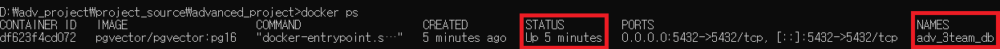

# 🏠 Youth Policy Chatbot

RAG 기반 청년 정책 추천 시스템

---

## 📌 프로젝트 개요

청년 정책은 종류가 많고 조건이 복잡하여, 사용자가 직접 검색하고 해석하기 어렵습니다.
본 프로젝트는 자연어 입력을 기반으로 사용자의 상황을 이해하고,
관련 정책을 자동으로 탐색 및 추천하는 시스템을 구현하는 것을 목표로 합니다.

---

## 🎯 주요 기능

### 1. 자연어 기반 사용자 입력 처리

- 사용자가 자신의 상황을 자유롭게 입력
- 예:
  `“서울 사는 27세 무주택 구직자인데 월세 지원 받을 수 있을까?”`

---

### 2. 사용자 조건 구조화 (Profile Parsing)

- 입력 문장에서 나이, 지역, 주거 상태, 소득 등을 추출
- 구조화된 profile 형태로 변환하여 활용

---

### 3. 멀티턴 대화 처리

- 이전 대화 내용을 기반으로 사용자 조건 누적
- Redis를 활용한 세션 기반 상태 관리

예시:

```id="c1qz9k"
사용자: 나는 25살이야
사용자: 서울 살아
→ age: 25, region: 서울
```

---

### 4. RAG 기반 정책 추천

- 정책 데이터(CSV, JSON)를 기반으로 검색
- 사용자 조건과 매칭되는 정책 후보 도출
- 정책 근거 및 추가 확인 조건 제공

---

### 5. 정책 판단 및 안내

- 현재 조건으로 가능한 정책 여부 판단
- 부족한 정보(소득, 세대주 여부 등) 안내

---

## 🏗️ 시스템 아키텍처

```id="gq1z8m"
Frontend (React)
        ↓
Backend (FastAPI)
        ↓
Redis (세션 / 상태 관리)
        ↓
AI Modules
 ├─ Profile Parser
 ├─ Eligibility 판단
 └─ RAG Retrieval
        ↓
정책 추천 결과 반환
```

---

## ⚙️ 기술 스택

### Backend

- FastAPI
- Redis (세션 및 상태 관리)
- PostgreSQL (정책 데이터 저장)

### Frontend

- React (Vite + TypeScript)

### AI / Data

- RAG (Retrieval-Augmented Generation)
- 정책 데이터 (CSV, JSON)

### Infra

- Docker / Docker Compose

---

## 📂 프로젝트 구조

```id="6d2q9p"
backend/
 ├─ app/
 │   ├─ api/            # API 라우터
 │   ├─ services/       # 비즈니스 로직
 │   ├─ repositories/   # Redis / DB 접근
 │   ├─ ai_modules/     # AI 모듈 (파서, RAG 등)
 │   └─ schemas/        # 데이터 모델

frontend/
database/
docker-compose.yml
env.sample
```

---

## 🔑 핵심 설계

### 세션 기반 상태 관리

- 사용자별 session_id를 통해 대화 구분
- Redis에 상태(state)와 메시지(messages) 저장

```id="p9zq1k"
session:{session_id}
session:{session_id}:state
session:{session_id}:messages
```

---

### 멀티턴 컨텍스트 처리

- 이전 사용자 상태 + 최근 대화 + 현재 질문을 결합
- AI 모듈 입력을 위한 컨텍스트 구성

---

### 데이터 분리 전략

- 사용자 입력(raw_text)과 AI 프롬프트를 분리하여 관리
- 상태 데이터의 일관성 유지

---

## 🧪 실행 방법

```bash id="b3kz1p"
# 환경 변수 설정
cp env.sample .env

# Docker 실행
docker-compose up --build

# Backend 실행
cd backend
uvicorn app.main:app --reload

# Frontend 실행
cd frontend
npm install
npm run dev
```

---

## ⚠️ 고려 사항

- 정책 추천은 사용자 입력 정보에 따라 결과가 달라짐
- 소득, 세대주 여부 등 추가 정보가 필요할 수 있음
- 일부 조건은 추정하지 않고 명시된 정보만 사용

---

## 📈 향후 개선 방향

- 정책 데이터 확장 및 최신화
- 추천 정확도 개선 (RAG 고도화)
- 다중 채팅(대화 세션) 지원
- UI/UX 개선

---

## 🧾 프로젝트 목적

본 프로젝트는
자연어 처리 기반 정책 추천 시스템을 구현하며,
백엔드, AI, 데이터 처리 기술을 통합적으로 활용하는 것을 목표로 합니다.

---

## docker를 통한 PostgreSQL 서버 및 redis 서버 실행 방법

**기본 단계**

1. cmd 창 열기
2. 현재 프로젝트 경로로 이동
3. env.sample 파일 복사 후, 복사된 파일 .env로 변경(**env.sample 원본은 추후 환경설정을 위해 유지 필요!!**)

**PostgreSQL 서버 및 redis 서버 한번에 실행**

1. docker-compose up -d 명령어 입력
2. docker ps 명령어 실행 후 adv_3team_db, adv_3team_redis 이름의 container 가 Up 상태인지 확인
   

**PostgreSQL 서버 혹은 redis 서버 하나만 실행**

1. DB : docker-compose up -d adv_3team_db / redis : docker-compose up -d adv_3team_redis
2. docker ps 명령어 실행 후 실행한 이름의 container 가 Up 상태인지 확인

3. 정상적으로 Up 확인 이후, DB툴/redis툴 통해서 접속
4. 접속의 필요한 정보는 복사된 .env 파일 참조
